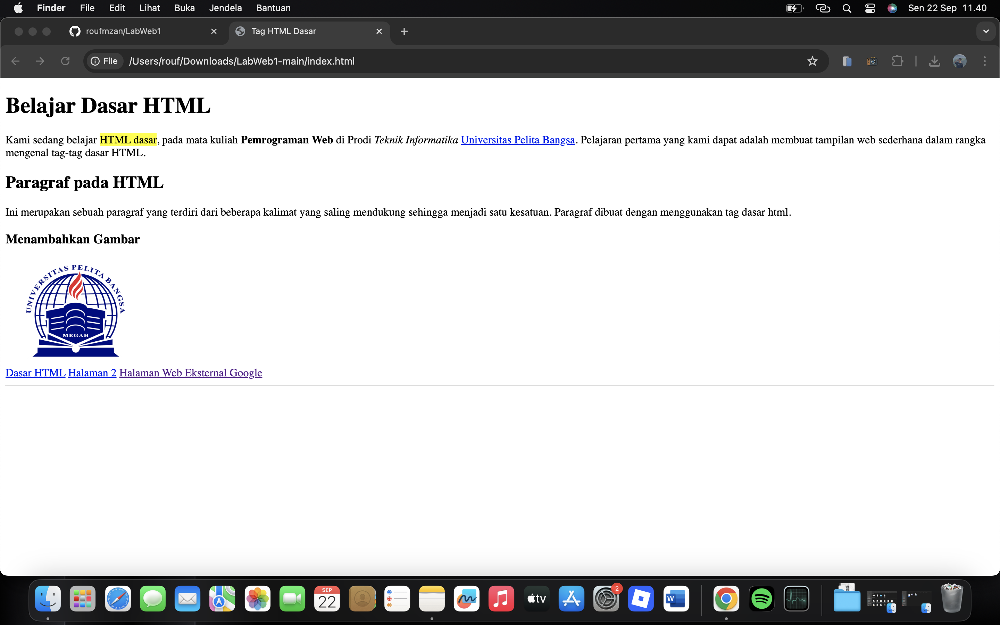

# Praktikum 1 : HTML Dasar

|                |                    |
| -------------- | ------------------ |
|      _Nama_    | ROUF MUHAMMAD FAUZAN |
|      _NIM_     |      312410157     |
|     _Kelas_    |      TI.24.A1      |
|  _Mata Kuliah_ | Bahasa Pemrograman Web 1 |

**Hasil Output**



# Belajar Dasar HTML

Proyek ini merupakan latihan **HTML dasar** pada mata kuliah *Pemrograman Web* di Prodi **Teknik Informatika Universitas Pelita Bangsa**.  
Tujuan utama dari latihan ini adalah memahami penggunaan tag-tag HTML dasar untuk membuat halaman web sederhana.

---

## 📖 Deskripsi
Halaman web ini menampilkan beberapa elemen dasar HTML, di antaranya:
- **Heading** (`<h1>`, `<h2>`, dll.)
- **Paragraf** (`<p>`)
- **Teks dengan format khusus** (tebal, miring, mark / highlight)
- **Gambar** (``)
- **Hyperlink** (`<a>`)

---

## 🖼️ Tampilan
Berikut contoh tampilan halaman web:


---

## 📂 Struktur File

**Penjelasan Code**
```
<!DOCTYPE html>
<html>
<head>
    <title>Tag HTML Dasar</title>
    <meta charset="UTF-8">
</head>
<body>

    <!-- Judul utama -->
    <h1>Belajar Dasar HTML</h1>

    <!-- Paragraf pertama dengan format teks -->
    <p>
        Kami sedang belajar <mark>HTML dasar</mark>, pada mata kuliah 
        <b>Pemrograman Web</b> di Prodi <i>Teknik Informatika</i> 
        <a href="https://www.pelitabangsa.ac.id">Universitas Pelita Bangsa</a>. 
        Pelajaran pertama yang kami dapat adalah membuat tampilan web sederhana 
        dalam rangka mengenal tag-tag dasar HTML.
    </p>

    <!-- Sub Judul -->
    <h2>Paragraf pada HTML</h2>

    <!-- Paragraf kedua -->
    <p>
        Ini merupakan sebuah paragraf yang terdiri dari beberapa kalimat yang saling 
        mendukung sehingga menjadi satu kesatuan. Paragraf dibuat dengan menggunakan 
        tag dasar html.
    </p>

    <!-- Sub Judul untuk gambar -->
    <h3>Menambahkan Gambar</h3>

    <!-- Menampilkan gambar -->
    

    <nav> 
        <a href="lab1_tag_dasar.html">Dasar HTML</a> 
        <a href="lab1_halaman2.html">Halaman 2</a> 
        <a href="http://www.google.com">Halaman Web Eksternal Google</a> 
    </nav> 
    <hr> 

</body>
</html>
```
